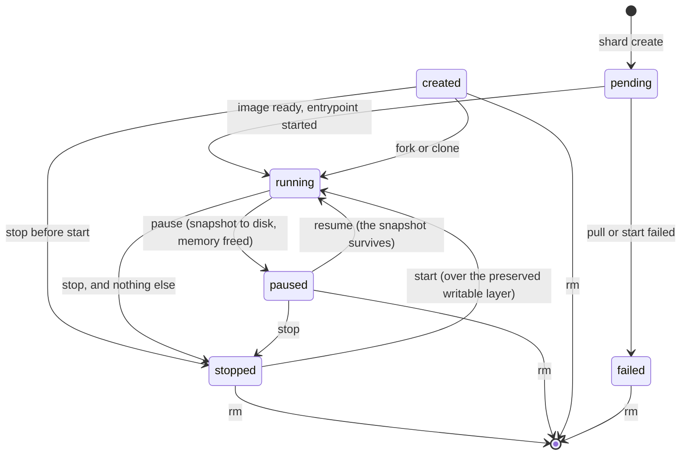

# The sandbox state machine

Six states, nine legal moves. `models/state.go` is the code; this page is the picture.

| From | To | Verb | Reachable today |
|---|---|---|---|
| `pending` | `running` | the daemon finished the pull and the start | yes |
| `pending` | `failed` | the pull or the start failed | yes |
| `created` | `running` | a fork or clone | yes |
| `created` | `stopped` | `stop`, if any path left a sandbox in `created` | no |
| `running` | `paused` | `pause` | yes: gVisor |
| `running` | `stopped` | `stop` | yes |
| `paused` | `running` | `resume` | yes: gVisor |
| `paused` | `stopped` | `stop` | yes |
| `stopped` | `running` | `start` | yes |

## What the picture does not say

**A create begins `pending`, and the daemon finishes it in the background.** `shard create` writes
the record `pending` and answers at once, unless the image is already pulled: a cached image needs
no download, so the create runs to `running` before it answers. An uncached one pulls and starts
behind the record, which lands `running` or, when the pull or the start failed, `failed` with a
one-line `failed_reason`. `GET ?wait=true` holds until the record leaves `pending`, so `shard create`
blocks and prints a ready sandbox or the reason it failed. `created` is not where a create lands: it
is the state a fork or clone's copy passes through, and the status a provider reports for a sandbox
it holds but has not started. No verb parks a sandbox in `created`: a fork or clone drives its copy
on to `running` with nothing an operator can stop in between, which is why `created --> stopped` is
in the machine but reachable by nothing.

**`failed` is terminal, and only `rm` frees it.** A create that never reached `running` refuses every
verb but `get` and `rm`, with `409 sandbox_failed` and the reason, so an operator reads why and then
removes it. A daemon that restarted while a create was still in flight finds the `pending` record
with nothing behind it and moves it to `failed` too, because a create the daemon dropped never
finished.

**A sandbox outlives its entrypoint, so the entrypoint exiting is not a transition.** `running` means
the sandbox is up, not that a workload executes in it. When the entrypoint finishes the sandbox stays
`running` and you can still `exec`, `pause` or `fork` it. This is what E2B, Modal, Vercel and Daytona
all do. There is no fifth state for it: the liveness task writes the exit into `exit_status` on the
still-`running` record instead, so `shard ls` prints `running (exited 0)`. **`stop` is the only
thing that ends a sandbox.**

**`stop` returns once the sandbox has stopped.** The substrate can report one alive for a moment after
a clean stop, so `stop` waits for it to be gone before it writes the record, and fails without changing
the record if that has not happened within 5 seconds of the substrate returning. A `rm` right behind a
`stop` is therefore never refused with `stop it first`.

**`stopped` is not terminal, and it is not a provider verb either.** Every sandbox has its own
writable layer over the shared read-only image, so `shard start` re-runs the entrypoint and finds the
files the last run wrote. Memory, pids and sockets are gone; files are not. The substrate cannot do
that move: `Provider.Start` refuses a stopped sandbox, so `shard start` (SHARD-24) is `Remove` plus a
second `Create` over the preserved writable layer.

**`created --> stopped` is a legal move nothing reaches, and it would leave nothing at the substrate.**
Stopping a sandbox whose entrypoint never ran is a delete there, because a runtime refuses to signal a
container that never started. The record says `stopped` while `Provider.Status` reports `Exists: false`.
That is the intended answer: the
record is what survives, and `Status` is only ever what the substrate says now. A paused sandbox is
the second case: the record says `paused` and `Status` reports `Exists: false`, because the pause
deleted it from the substrate and only the snapshot holds it. A `pause` also kills any `exec` in flight.

**There is no `checkpointed` state.** `pause` writes the snapshot to disk and frees the memory, so a
paused sandbox holds no RAM. There is no in-memory pause to distinguish it from. `checkpoint` and
`restore` survive only as the `runsc` command names, never in the CLI, the API or the state records.

**`rm` is not a state.** It removes the record and everything under it. `Provider.Remove` force-ends
a running sandbox rather than refusing one, because nothing else drops the rootfs mount.

**`fork` is not a transition.** It creates a second sandbox in `running` and leaves the source in
whatever state it was in. A snapshot is immutable and a resume does not consume it, so one `pause`
plus `fork --count N` is the warm pool primitive.

**`clone` is not a transition either.** It creates a second sandbox in `running` over a copy of the
files a `stopped` or `paused` source kept, and runs the entrypoint from the beginning: a `start`
under a new id. It takes no memory and reads no snapshot, so it is a required verb on every provider,
and it refuses a `running` source rather than copy a layer that is still being written. A `clone`
holds the source shared while it copies, so a `start`, `stop` or `rm` of the source waits for it.

**A legal move is not always a possible move.** `State.CanTransitionTo` answers only whether the
move is in the machine. Whether it can happen now is the orchestrator's question, and whether this
substrate can do it at all is the provider's: `pause`, `resume` and `fork` are optional verbs, and a
provider that lacks one reports `false` from `Capabilities` and returns `ErrUnsupported`.
