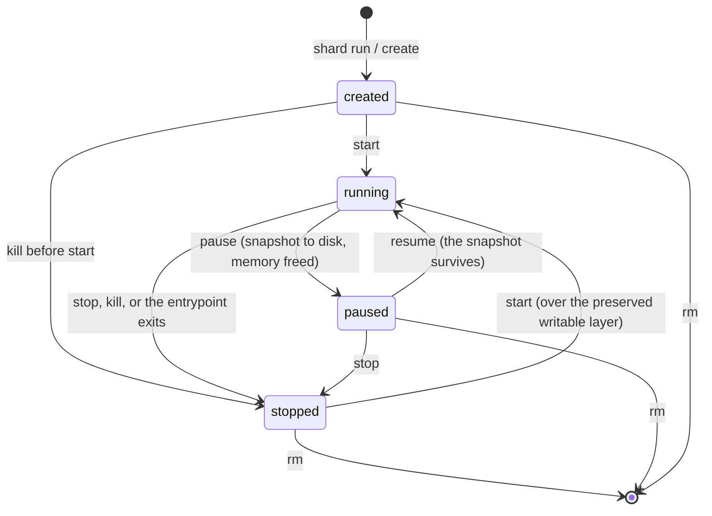

# The sandbox state machine

Four states, seven legal moves. `models/state.go` is the code; this page is the picture.

| From | To | Verb |
|---|---|---|
| `created` | `running` | `start` |
| `created` | `stopped` | `kill` before the entrypoint runs |
| `running` | `paused` | `pause` |
| `running` | `stopped` | `stop`, `kill`, or the entrypoint exits |
| `paused` | `running` | `resume` |
| `paused` | `stopped` | `stop` |
| `stopped` | `running` | `start` |

## What the picture does not say

**`stopped` is not terminal.** It is terminal at the `runsc` level, and it is not terminal here.
Every sandbox has its own writable layer over the shared read-only image, so `shard start` re-runs
the entrypoint and finds the files the last run wrote. Memory, pids and sockets are gone; files are
not.

**There is no `checkpointed` state.** `pause` writes the snapshot to disk and frees the memory, so a
paused sandbox holds no RAM. There is no in-memory pause to distinguish it from. `checkpoint` and
`restore` survive only as the `runsc` command names, never in the CLI, the API or the state records.

**`rm` is not a state.** It removes the record and everything under it. A running sandbox must be
stopped first.

**`fork` is not a transition.** It creates a second sandbox in `running` and leaves the source in
whatever state it was in. A snapshot is immutable and a resume does not consume it, so one `pause`
plus `fork --count N` is the warm pool primitive.

**A legal move is not always a possible move.** `State.CanTransitionTo` answers only whether the
move is in the machine. Whether it can happen now is the orchestrator's question, and whether this
substrate can do it at all is the provider's: `pause`, `resume` and `fork` are optional verbs, and a
provider that lacks one reports `false` from `Capabilities` and returns `ErrUnsupported`.
