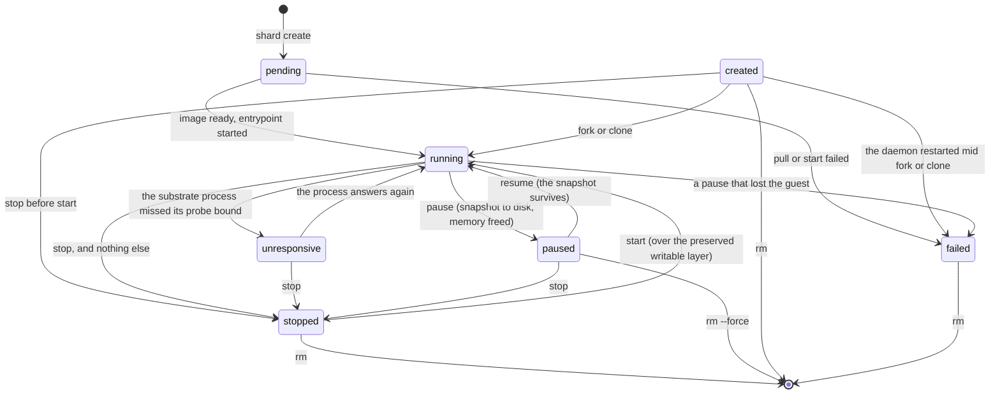

# The sandbox state machine

A sandbox has seven states and fourteen legal moves between them. The code is `models/state.go`, and
this page draws the same machine.

```mermaid
stateDiagram-v2
    [*] --> pending: shard create
    pending --> running: image ready, entrypoint started
    pending --> failed: pull or start failed
    created --> running: fork or clone
    created --> stopped: stop before start
    created --> failed: the daemon restarted mid fork or clone
    running --> paused: pause (snapshot to disk, memory freed)
    running --> stopped: stop, and nothing else
    running --> failed: a pause that lost the guest
    running --> unresponsive: the substrate process missed its probe bound
    unresponsive --> running: the process answers again
    unresponsive --> stopped: stop
    paused --> running: resume (the snapshot survives)
    paused --> stopped: stop
    stopped --> running: start (over the preserved writable layer)
    stopped --> [*]: rm
    paused --> [*]: rm --force
    created --> [*]: rm
    failed --> [*]: rm
```

| From | To | Verb | Reachable today |
|---|---|---|---|
| `pending` | `running` | the daemon finished the pull and the start | yes |
| `pending` | `failed` | the pull or the start failed | yes |
| `created` | `running` | a fork or clone | yes |
| `created` | `stopped` | `stop`, if any path left a sandbox in `created` | no |
| `created` | `failed` | the daemon restarted before a fork or clone reached `running` | yes |
| `running` | `paused` | `pause` | yes: gVisor |
| `running` | `stopped` | `stop` | yes |
| `running` | `failed` | a `pause` that broke off after its checkpoint began | yes: gVisor |
| `running` | `unresponsive` | the liveness tick, or a vz `exec` or `pause` whose probe the substrate process missed | yes: vz, Firecracker |
| `unresponsive` | `running` | the liveness tick, when the process answers again | yes: vz, Firecracker |
| `unresponsive` | `stopped` | `stop` | yes: vz, Firecracker |
| `paused` | `running` | `resume` | yes: gVisor |
| `paused` | `stopped` | `stop` | yes |
| `stopped` | `running` | `start` | yes |

## What the picture does not say

**A create begins `pending`, and the daemon finishes it in the background.** `shard create` writes
the record as `pending` and answers at once. When the image is already pulled, the create runs to
`running` before it answers, because a cached image needs no download. For an uncached image, the
daemon pulls and starts the sandbox behind the record. The record then lands in `running`, or in
`failed` with a one-line `failed_reason` when the pull or the start failed. `shard create` sends
`POST ?wait=true`, which holds until the record leaves `pending` and streams the pull while it waits.
The CLI prints each layer on stderr, then the ready sandbox or the reason it failed.

`created` is not where a create lands. It is the state that the copy of a fork or clone passes
through, and the status a provider reports for a sandbox it holds but has not started. No verb parks a
sandbox in `created`, because a fork or clone drives its copy on to `running` with no point in between
where an operator can stop it. That is why `created --> stopped` is in the machine but nothing
reaches it.

**`failed` is terminal, and only `rm` frees it.** A create that never reached `running` refuses every
verb except `get` and `rm`. The refusal is `409 sandbox_failed` with the reason, so an operator can
read why the create failed and then remove the sandbox. A gVisor `pause` that broke off after its
checkpoint began also lands here. The sentry exits after any checkpoint, so nothing is left to thaw.
When the daemon restarts while a create is still in flight, it finds the `pending` record with
nothing behind it. It moves that record to `failed` too, because a create the daemon dropped never
finished. A `created` record at a restart is a fork or clone the daemon dropped, so it also ends in
`failed`. The daemon first stops a copy that still runs and tears down its substrate, because a
restore that the old daemon started can still run where the runtime cannot see it.

**A sandbox outlives its entrypoint, so the entrypoint exiting is not a transition.** `running`
means that the sandbox is up. It does not mean that a workload executes in it. When the entrypoint
finishes, the sandbox stays `running` and you can still `exec` or `pause` it, and `fork` it once
paused. E2B, Modal, Vercel and Daytona all work this way. There is no eighth state for an exited
entrypoint. Instead, the liveness task writes the exit into `exit_status` on the record, which stays
`running`, so `shard ls` prints `running (exited 0)`. `stop` is the only thing that ends a sandbox.

**`unresponsive` is a running sandbox whose substrate process went silent, and only `stop` ends
it.** On vz the daemon probes each shim within 5 s, both a shim it holds and one that it meets only
by its socket after a restart. A shim that is silent for the whole bound makes the record
`unresponsive`. A `SIGSTOP` can freeze a shim that way, and so can a host under load. The record
keeps its pid and its run, and `unresponsive_reason` names the shim's pid. Nothing kills the shim,
because a thawed shim gives back the same VM. `shard ls` prints `unresponsive (its shim (pid N) did
not answer within 5s)`, and `shard inspect` holds the state and the reason. `exec`, `start` and
`pause` refuse the sandbox with the reason, and `exec` adds `wait for it to answer, or end it with
shard stop <id>`. An `exec` or a `pause` that finds the shim silent writes `unresponsive` at once,
not at the next tick, and a `pause` spends one 5 s bound on it (SHARD-424). When a later probe
answers, the next liveness tick writes `running` again. `stop` and `rm --force` give the shim one
more probe of 1 s, then kill it with no grace (SHARD-421). The kill goes through a pin that the
kernel holds on the process, never through a bare pid, so a process that took the pid since is never
hit. On Firecracker the same holds for a vmm that a restart meets only by its socket, with a bound
of 4 s and a reason that names the vmm's pid (SHARD-392). There the pin is a pidfd that the adopt
took on the connection that the vmm never answered.

**`stop` returns once the sandbox has stopped.** After a clean stop, the substrate can still report
the sandbox alive for a moment. So `stop` waits for the sandbox to be gone before it writes the
record. If the sandbox is not gone within 5 seconds of the substrate returning, the verb fails and
leaves the record unchanged. Because of this wait, a `rm` right after a `stop` is never refused with
`stop it first`.

**`stopped` is not terminal, and the move out of it is not a provider verb.** Every sandbox has its
own writable layer over the shared read-only image, so `shard start` re-runs the entrypoint and finds
the files the last run wrote. Memory, pids and sockets do not survive a stop, but the files do. The
substrate cannot make that move, because `Provider.Start` refuses a stopped sandbox. So `shard start`
(SHARD-24) is a `Remove` followed by a second `Create` over the preserved writable layer.

**`created --> stopped` is a legal move that nothing reaches, and it would leave nothing on the
substrate.** On the substrate, stopping a sandbox whose entrypoint never ran is a delete, because a
runtime refuses to signal a container that never started. The record then says `stopped` while
`Provider.Status` reports `Exists: false`. This answer is intended, because the record is what
survives and `Status` only ever reports what the substrate says now. A paused sandbox is the second
case. Its record says `paused` and `Status` reports `Exists: false`, because the pause deleted the
sandbox from the substrate and only the snapshot holds it. A `pause` also kills any `exec` in flight.

**There is no `checkpointed` state.** `pause` writes the snapshot to disk and frees the memory, so a
paused sandbox holds no RAM. There is no in-memory pause to tell it apart from. The words `checkpoint`
and `restore` appear only as `runsc` command names. The CLI, the API and the state records do not use
them.

**`rm` is not a state.** It removes the record and everything under it. `Provider.Remove` force-ends
a running sandbox instead of refusing it, because nothing else drops the rootfs mount.

**`fork` is not a transition.** It takes a `paused` source only, because it reads the snapshot the
pause wrote, and it refuses any other state. It creates a second sandbox in `running` and leaves the
source `paused`. A snapshot is immutable and a resume does not consume it, so one `pause` followed by
one `shard fork <source>` per new sandbox is the primitive for a warm pool.

**`clone` is not a transition either.** It creates a second sandbox in `running` over a copy of the
files that a `stopped` or `paused` source kept. It runs the entrypoint from the beginning, so it acts
as a `start` under a new id. It takes no memory and reads no snapshot, so it is a required verb on
every provider. It refuses a `running` source, because it will not copy a layer that is still being
written. A `clone` holds the source in shared mode while it copies, so a `start`, `stop` or `rm` of
the source waits for it.

**A legal move is not always a possible move.** `State.CanTransitionTo` answers only whether the
move is in the machine. The orchestrator decides whether the move can happen now. The provider decides
whether its substrate can make the move at all. `pause`, `resume` and `fork` are optional verbs, and a
provider that lacks one reports `false` from `Capabilities` and returns `ErrUnsupported`.
